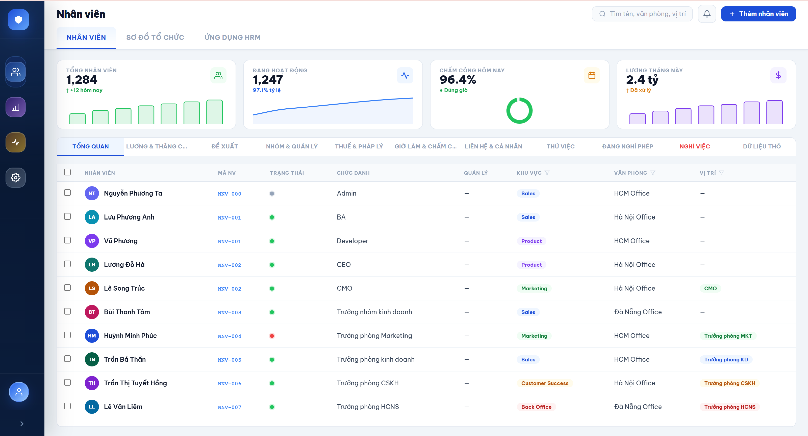
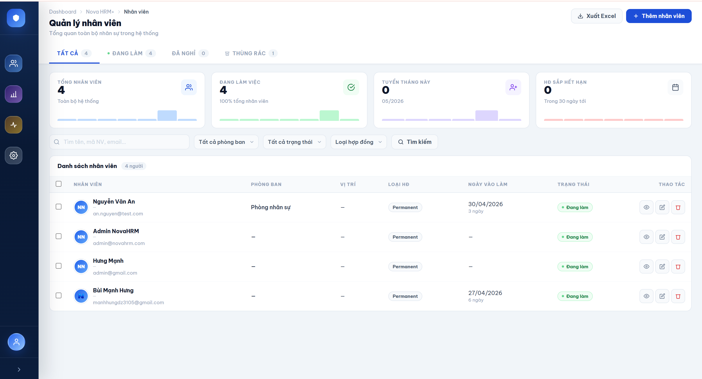

# NovaHRM

<p align="center">
  <strong>Modern Human Resource Management System</strong>
</p>

<p align="center">
  <a href="https://novahrm.io.vn">🌐 Website</a>
</p>

---

## Preview

<p align="center">
  
</p>

<p align="center">
  
  
</p>

<p align="center">
  
  
</p>

---

<p align="center">
<a href="#"></a>
<a href="#"></a>
<a href="#"></a>
<a href="#"></a>
<a href="#"></a>
</p>

---

## About NovaHRM

**NovaHRM** is a modern open-source **Human Resource Management (HRM)** platform built with **Laravel 11** and **Blade Template Engine**.

The project is designed with a modular architecture, clean UI, and scalable structure to help developers and businesses build HR systems faster and easier.

NovaHRM focuses on simplicity, performance, and developer experience while still providing a modern user interface.

---

## Overview

NovaHRM provides a solid foundation for building:

* Human Resource Management Systems
* Internal Management Platforms
* ERP Systems
* Startup MVP Products
* Graduation / Academic Projects

---

## Tech Stack

* **Laravel 11**
* **PHP 8.2+**
* **Blade Template Engine**
* **Tailwind CSS**
* **Alpine.js**
* **MySQL / MariaDB**
* **Vite**

---

## Core Features

### Employee Management

* Employee profiles
* Department management
* Position & role management
* Employee status tracking
* Avatar & personal information management

### Attendance System

* Check-in / check-out
* Attendance history
* Daily attendance tracking
* Basic attendance reports

### Leave Management

* Leave requests
* Approval workflows
* Leave balance tracking

### Payroll Management

* Salary structure
* Payroll overview
* Payment history

### Task Management

* Kanban task board
* Task assignment
* Progress tracking
* Team collaboration

### Calendar & Events

* Company events
* Schedule overview
* Personal calendar

### Notifications

* Real-time notifications
* Internal alerts
* System announcements

### Employee Portal

* Personal dashboard
* Profile management
* Self-service features

---

## Demo Screenshots

### Dashboard

<p align="center">
  
</p>

### Employee Management

<p align="center">
  
</p>

### Attendance System

<p align="center">
  
</p>

### Task Board

<p align="center">
  
</p>

### Calendar

<p align="center">
  
</p>

---

## Installation

### Clone Repository

```bash
git clone https://github.com/scoppy9201/Novahrm.git
cd Novahrm
```

### Install Dependencies

```bash
composer install
npm install
```

### Environment Setup

```bash
cp .env.example .env
php artisan key:generate
```

### Configure Database

Update your `.env` file:

```env
DB_DATABASE=novahrm
DB_USERNAME=root
DB_PASSWORD=
```

### Run Migration & Seeder

```bash
php artisan migrate --seed
```

### Start Development Server

```bash
php artisan serve
npm run dev
```

---

## Authentication & Authorization

* Authentication system included
* Custom login UI
* Role & permission ready
* Easy to extend for RBAC systems

---

## Project Structure

NovaHRM uses a modular and maintainable architecture:

* Service-based structure
* Reusable Blade components
* Modular packages
* Clean separation between:

  * Business logic
  * Controllers
  * Services
  * Views
  * Components

---

## Use Cases

NovaHRM can be used for:

* Company HR systems
* Startup internal tools
* ERP platforms
* Team management systems
* Educational projects

---

## Roadmap

Planned upcoming modules:

* Recruitment Management
* Performance Reviews
* Training Management
* Asset Management
* Advanced Payroll System
* AI Assistant Integration
* Real-time Chat

---

## Contributing

Contributions are welcome.

1. Fork the repository
2. Create your feature branch
3. Commit your changes
4. Push to the branch
5. Open a Pull Request

---

## License

This project is licensed under the MIT License.

---

## Links

* Website: [https://novahrm.io.vn](https://novahrm.io.vn)
* GitHub: [https://github.com/scoppy9201/Novahrm](https://github.com/scoppy9201/Novahrm)

---

<div align="center">
  Built with ❤️ using Laravel 11 & Blade
</div>

