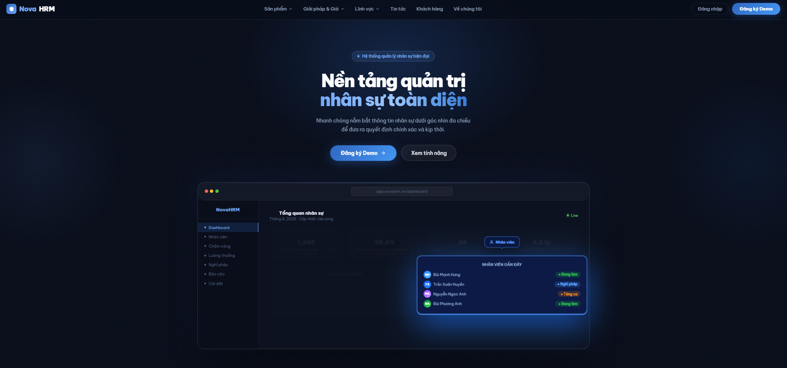

<p align="center">
  <strong>Modern Human Resource Management System</strong>
</p>

<p align="center">
  
</p>

<p align="center">
<a href="#"></a>
<a href="#"></a>
<a href="#"></a>
<a href="#"></a>
</p>

---

## About NovaHRM

**NovaHRM** is a modern, open-source **Human Resource Management (HRM)** system built with **Laravel** and **FilamentPHP**.

It is designed with a clean architecture, scalable structure, and developer-friendly approach to help teams build and customize HR systems quickly.

---

## Overview

NovaHRM provides a solid foundation for building full-featured HRM or ERP systems, suitable for startups, internal tools, or academic projects.

---

## Tech Stack

* **Laravel 12+**
* **FilamentPHP 3.x**
* **PHP 8.2+**
* **MySQL / MariaDB**
* **Tailwind CSS**
* **Alpine.js**

---

## Core Features

### Employee Management

* Employee profiles
* Departments & roles
* Status tracking

### Attendance System

* Check-in / check-out
* Attendance logs
* Basic reporting

### Leave Management

* Leave requests
* Approval workflows
* Leave tracking

### Payroll (Basic)

* Salary structure
* Payment tracking

### Task Management

* Kanban board
* Task assignment
* Progress tracking

### Internal Communication

* Messaging system
* Notifications

### Calendar

* Event tracking
* Schedule overview

### Employee Portal

* Self-service dashboard
* Personal data access

---

## Installation

```bash
git clone https://github.com/scoppy9201/Novahrm
cd novahrm

composer install
cp .env.example .env
php artisan key:generate
```

### Configure database

Update your `.env` file:

```env
DB_DATABASE=novahrm
DB_USERNAME=root
DB_PASSWORD=
```

### Run migrations & seeders

```bash
php artisan migrate --seed
```

### Start development server

```bash
composer run dev
```

---

## Authentication & Authorization

* Built-in authentication using **Filament Auth**
* Custom authentication pages supported
* Role & permission system ready for extension (e.g. RBAC)

---

## Architecture

NovaHRM follows a modern modular structure:

* Filament Resources (Admin UI)
* Filament Pages (Custom logic)
* Service-based architecture
* Clean separation of:

  * Models
  * Business logic
  * UI components

No traditional Blade-based admin UI is used.

---

## Use Cases

* HRM systems for companies
* Internal management tools
* Startup MVPs
* Graduation projects

---

## Roadmap

* Recruitment module
* Performance review
* Training management
* Asset management
* Advanced payroll

---

## Contributing

Contributions are welcome!

* Fork the repository
* Create a new branch
* Submit a pull request

---

## License

MIT License

---

<div align="center">
  Built with ❤️ using Laravel & Filament
</div>
